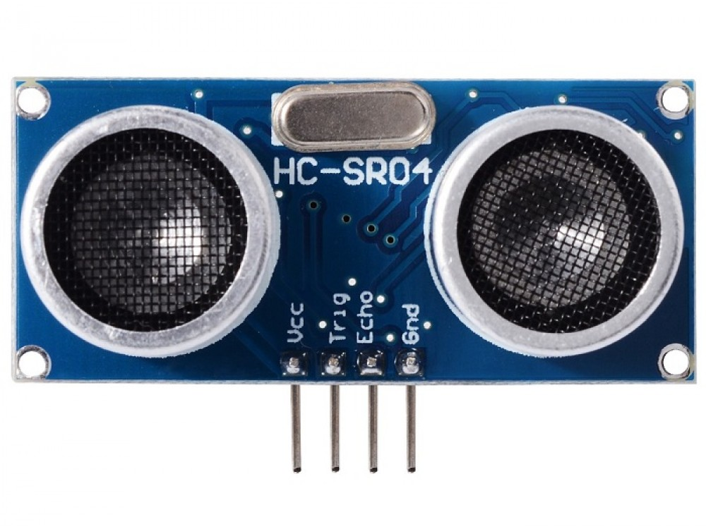
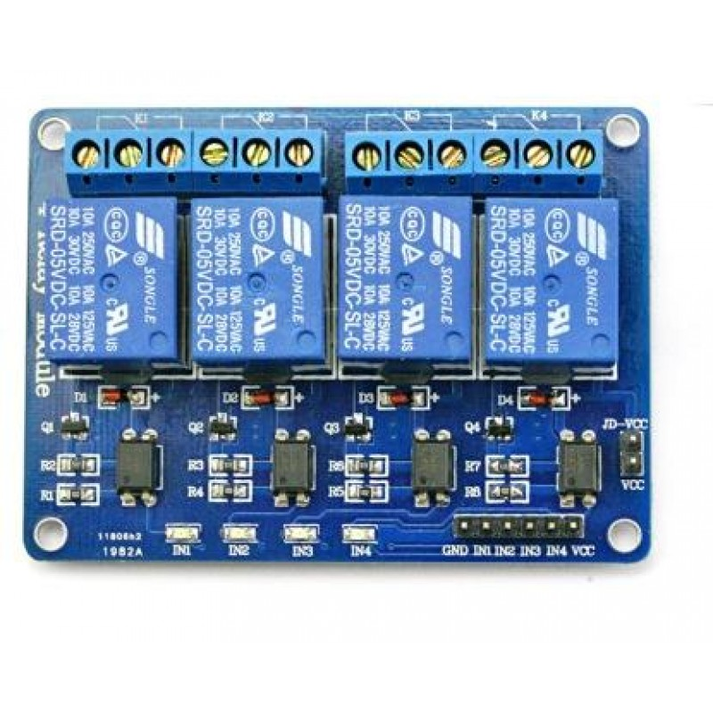

# Installing the Demo


The Demo solution consists of several components. Each component will be discussed below to maximize the chance of a succesful implementation.

## WiFi

WiFi is needed to allow the controllers to communicate with Rasperberry Pi. The Raspberry Pi is connecting via WiFi as well.

The SSID of the WiFi network is `PWN-IoT` and the passphrase `DrinkWater`.

## Raspberry Pi

When installing the Raspberry Pi you can decide to run the OS from an external USB drive instead of the built-in SD controller. This requires certain steps and not all USB drives will work. You don't have to boot from USB and can skip the next step if you want.

### USB Boot

If you want to boot from USB follow the steps
[here](https://www.raspberrypi.org/documentation/hardware/raspberrypi/bootmodes/msd.md).
In order to get it to work I needed an USB **3** device. I also had to
disconnect all other USB devices, such as mouse and keyboard.

### Downloading Raspian

This document assumes that Raspbian Stretch Full version will be used. This version is the biggest one and also contains a GUI and recommend tools.

Download a copy from [RaspberryPi.org](https://www.raspberrypi.org/downloads/raspbian/) and write it to either a USB3 thumb drive or a SD Card.

In order to do so you can follow the official installation procedure described [here](https://www.raspberrypi.org/documentation/installation/installing-images/README.md).

### Network configuration

It is possible to configure the WiFi *before* booting the Raspberry Pi from the newly baked image. This is called a *headless* (No monitor, mouse and keyboard) configuration. The steps are described [here](https://www.raspberrypi.org/documentation/configuration/wireless/headless.md).

This is an optional step. You can also connect via ethernet or connect to the WiFi manually.

Once you've installed the software boot the Raspberry Pi. Don't be surprised if the Raspberry Pi reboots, this is normal for a first time installation.

When the system is done booting you can login in as the user `pi` with password `raspbian`. 

This is a *very* well known combination of a username and password and should be changed immediatelly.

If not connected to the network (Ethernet or WiFi) you'll have to connect now. The next steps assume that there is connectivity to the internet.

### Installing Ansible

Ansible is one of the tools often used to configure systems. This can be done remotely or locally. 
Ansible has a configuration language that is used to describe the desired state of items.
Once Ansible is running it will compare the state of the system with the desired state and resolve any differences that might be present.

It is perfect for our purpose and the so called playbooks used to prepare this system are available through Github which we will use later on.

Right now we need to install Ansible manually...

Open a terminal session and enter the following commands:

```
sudo apt update
sudo apt install -y ansible
```

This will take a couple of minutes

<!--
### Install Hassbian

The installation process of installing Hassbian is described
[here](https://www.home-assistant.io/docs/installation/hassbian/installation/).
Note that you can either write the image to an USB drive or a SD card. It doesn't matter for the functioning of Hassbian.

Once you completed these steps boot the Raspberry Pi with the new OS and wait for it to start. Make sure it is connected to a monitor, keyboard and mouse when you continue.
-->

#### Github

The next step is to get some config files from github. Log in as the user 'pi' with password 'raspberry' on the console of the Raspberry pi. The type the following commands:

``` bash
cd
git clone https://github.com/mverleun/PWN-Demo.git
```

This will clone the repository to the Raspberry Pi. This repository contains some config files and the firmware that can be used later.

### Mosquitto

### Node RED

<!--
#### Get the GUI back

Hassbian comes without a GUI. Let's get it back. Install all the software required by the Raspberry Pi's GUI:

``` bash
sudo apt install lightdm raspberrypi-ui-mods chromium-browser mosquitto
```
-->

#### ESPHome

Next install software needed to maintain the firmware on the controllers:

```
sudo python -c "$(curl -fsSL https://raw.githubusercontent.com/platformio/platformio/develop/scripts/get-platformio.py)"
sudo pip install esphome
```

#### Configure networking

Edit the file: `/etc/wpa_supplicant/wpa_supplicant.conf` and make sure it contains the following settings:

```
ctrl_interface=DIR=/var/run/wpa_supplicant GROUP=netdev
update_config=1

# PWN network; allow all valid ciphers
network={
        ssid="PWN-IoT"
        scan_ssid=1
        key_mgmt=WPA-PSK
        psk="DrinkWater"
}
```

Change the IP address of the Raspberry Pi to a static address. Edit the file `/etc/dhcpcd.conf` and add the following lines to the end:

```
interface wlan0
static ip_address=192.168.42.254/24
static routers=192.168.42.1
static domain_name_servers=192.168.42.1
```

Reboot the Raspberry Pi to activate the new configuration. If all goes well it will connect to the WiFi.

### Installing screenly.io

Screenly is a so called 'digital signage' application that runs well on the Raspberry Pi.
It's not the most featured one, but compared to competitors it has one advantage: It runs as a standalone application.

Screenly will be used to periodically change and refresh the information on the display.

Install it by entering the following command:

```
bash <(curl -sL https://www.screenly.io/install-ose.sh)
```
This script will ask a couple of questions and then use [ansible](https://www.ansible.com) to do the installtion. How cool is that?

<!--
### Disabling screensaver and display timout

Changes are made to the file `/etc/xdg/lxsession/LXDE-pi/autostart`. Issue the following commands to change the content of this file:

```
sed -i 's/@xscreensaver/#@xscreensaver' /etc/xdg/lxsession/LXDE-pi/autostart
echo @xset s off >> /etc/xdg/lxsession/LXDE-pi/autostart
echo @xset -dpms >> /etc/xdg/lxsession/LXDE-pi/autostart
@xset s noblank >> /etc/xdg/lxsession/LXDE-pi/autostart
```

### Change webbrowser settings

If the webbrowser thinks it is crashed it will generate a notification when restarted. Disable it by entering the following command to the same config file as above:

```
echo @sed -i 's/"exited_cleanly": false/"exited_cleanly": true/' ~/.config/chromium/Default/Preferences >>  /etc/xdg/lxsession/LXDE-pi/autostart
```

Finaly we can turn on Kiosk mode:

```
echo @chromium --noerrdialogs --kiosk http://127.0.0.1:8043 >>  /etc/xdg/lxsession/LXDE-pi/autostart
```
-->

### And back to hass.io

Installing screenly destroy's wathever is installed as it seems...

Time to get hassio back...

This time a different approach. Since we have screenly we can run hassio in a Docker container.

```
sudo -i

add-apt-repository universe

apt-get update

apt-get install -y apparmor-utils apt-transport-https avahi-daemon ca-certificates curl dbus jq network-manager socat software-properties-common

curl -fsSL get.docker.com | sh

curl -sL "https://raw.githubusercontent.com/home-assistant/hassio-build/master/install/hassio_install" > hassio.sh

chmod +x hassio.sh

./hassio.sh -m raspberrypi3
```

## Controllers


The controllers used are all Wemos D1 mini controllers.


They are selected because of their built in WiFi and they are easy to connect to a PC using the builtin USB port.

Each controller has a number and a specific function. Controller 1, 3 and 5 measure the level of the water inside the tank and they also control the valves and pumps.

Controller 2, 4 and 6 measure the flow.

This can only be done if the proper sensors and/or actuators are connected.

In order to control the pumps and valves a relay board is used. The water level is measured using a HC-SR04 ultrasonic sensor.

The flow is measured using a pulse counter.

All the firmware is based on the [ESPHome](https://esphome.io) project. This allows us to create firmware without requiring real programming skills.

### Initial flashing

In order to get the controllers working you'll need a micro usb cable connected to the Raspberry Pi and the controller. Once you've got them working you can update them OTA (Over The Air) as long as they are connected to the WiFi.

Navigate to the directory containing the firmware: `cd ~/PWN-Demo/Firmware`.
First compile the software for controller 1. The configuration is inside a file called `tank-1.yaml`. Compiling it is done by entering `esphome tank-1.yaml compile` The first controller will take a long time, the toolkit required is downloaded and installed.

Notice that a directory is created named `controller_1`. Inside are the files needed to build the firmware.

Once you've build the firmware you can upload it with the command `esphome tank-1.yaml upload`

### Updating firmware

Whenever you change some settings of the firware you can update it over the air.
There are some restrictions to this process:

-   The controller has to be connected to the same network as the Raspberry Pi.

-   The name of the controller can't change. This name is retrieved from the
    yaml files and is used to connect to the right controller.

#### Connecting the hardware

##### Level sensor

The level is measured using a HC-SR04 device.



| HC-SR04 | Wemos D1 mini |
|---------|---------------|
| VCC     | +5V (!)       |
| GND     | GND           |
| Trig    | D6            |
| Echo    | D7            |

##### Relay board

The pump and valve are controlled using the following relayboard:



| Relay shield | Wemos D1 mini | Function |
|--------------|---------------|----------|
| VCC          | 3V3           |          |
| IN 1, IN 2   | D1            | Valve    |
| IN 3         | D2            | Pump     |
| GND          | GND           |          |

Note that both IN1 and IN2 are connected to D1. This is because we need two relays with the valve. Two relays allows us to reverse polarity, which in turn will change the direction of the motor controlling the valve, resulting in a open or close motion.

##### Flow meter

The flow is measured using a YF-S201C device. 


This is a meter that generates pulses. By counting the pulses we know the
flow.

| Flow meter | Wemos D1 mini |
|------------|---------------|
| Red        | +5V (!)       |
| Yellow     | D4            |
| Black      | GND           |


