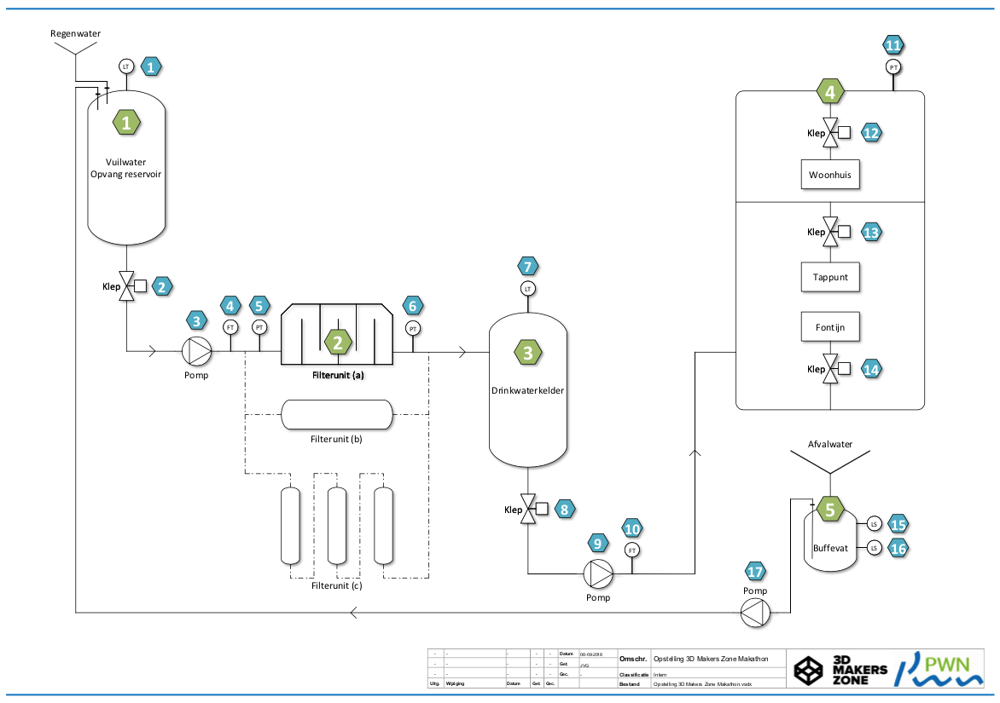

# PWN Demo
This repository contains files and firmware that is used for the demo setup of PWN in Haarlem.

Basically it is a simulation of the process of purifying water into drinkingwater.

## Process flow
The following diagram shows the steps 

It all starts with the collection of rainwater and storing it in a tank.

From this tank the water passes one or more filters. After purification the water is stored in a holding tank.

Finally there are consumers using the water from the holding tank. Their waste water will be returned to the first tank and be blended with the rain water.

In total there are 5 main steps indicated by the green numbers.

## Controllers
Each main step has it's own controller to make sure that everything works fine.

Each tank, used in step 1, 3 and 5, uses a sensor to measure the level of the tank. Each tank has a valve in the outlet and a pump. The pump might leak through hence the valves.

The main controlling is done centrally, but the controllers of the tanks need to have some buitin logic to prevent the pump from running when a flooding situation might occur.

The firmware of the controllers is based on [ESPHome](https://esphome.io). 

## Central control
A Raspberry Pi is used as a central process control unit. 
The Raspberry Pi is running Hassbian as the operating system. Hassbian is a special OS specifically designed for [Home Assistant](https://www.home-assistant.io) and very usefull in our case.

Communication between de central control and the controllers is done via the MQTT protocol.

The Raspberry Pi also has a MQTT broker on board. The MQTT broker is Mosquitto

## WiFi
In order to make the solution as robust as possible the demonstration setup has it's own WiFi network to isolate from external influences and less dependent on internet access.

# Installing...
Check the [installation guide](INSTALLING.md)
